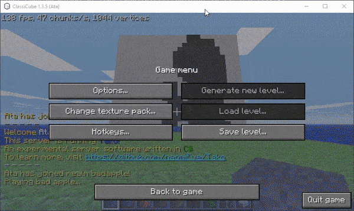

# Tako.BadApple

Exactly what you think it is.

## Installation

Drag `BadApplePlugin.cs` into the `plugins/` folder in your Tako installation. It will compile itself.

## Usage

First type `/move badapple` to move to the bad apple realm. Inside there, type `/badapple` to start the playback.

## Why

I was bored

## License

The code and the generator are Unlicensed. Bad Apple is not.